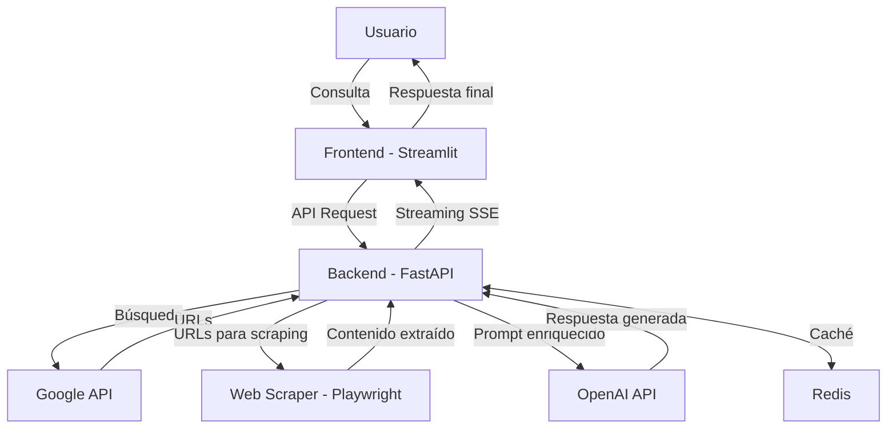

# InternetWhisper


## 📝 Descripción del Proyecto

InternetWhisper es un chatbot de IA avanzado que combina la potencia de los modelos de lenguaje de última generación con la capacidad de buscar y procesar información actualizada de Internet. A diferencia de los chatbots tradicionales limitados a datos de entrenamiento estáticos, InternetWhisper puede navegar por la web, extraer información relevante y proporcionar respuestas contextualizadas y actualizadas a las consultas de los usuarios.

El proyecto está diseñado para ofrecer una experiencia conversacional fluida mientras aprovecha fuentes de información en tiempo real, implementando técnicas de Retrieval-Augmented Generation (RAG) para mejorar la precisión y relevancia de las respuestas.

## 🔧 Arquitectura Técnica

InternetWhisper consta de tres componentes principales:

### 1. Frontend (Streamlit)

Una interfaz de usuario intuitiva desarrollada con Streamlit que permite a los usuarios:
- Interactuar con el chatbot mediante un chat conversacional
- Visualizar las fuentes de información utilizadas en cada respuesta
- Configurar preferencias de búsqueda y visualización

### 2. Backend/Orchestrator (FastAPI)

El núcleo del sistema, desarrollado con FastAPI, que:
- Coordina el flujo de información entre todos los componentes
- Implementa el sistema RAG (Retrieval-Augmented Generation)
- Gestiona las conexiones con APIs externas (OpenAI, Google)
- Utiliza Redis para caché y almacenamiento de sesiones
- Proporciona endpoints para streaming de respuestas en tiempo real

### 3. Web Scraper (Playwright)

Un componente especializado que:
- Extrae contenido relevante de páginas web identificadas
- Procesa y estructura la información para su uso en el sistema RAG
- Navega de forma eficiente por sitios web complejos

### Flujo de Datos

1. El usuario envía una consulta a través del frontend de Streamlit
2. El orchestrator recibe la consulta y determina si necesita información externa
3. Si es necesario, utiliza la API de Google para identificar fuentes relevantes
4. El scraper extrae y procesa el contenido de las URLs seleccionadas
5. El orchestrator enriquece el prompt para OpenAI con la información extraída
6. La respuesta generada se transmite de vuelta al usuario mediante SSE (Server-Sent Events)
7. Los datos relevantes se almacenan en caché en Redis para optimizar consultas futuras



## 🔐 Configuración de Variables de Entorno

Crea un archivo `.env` en la raíz del proyecto con las siguientes variables:

```
# APIs Externas
OPENAI_API_KEY=tu_clave_api_de_openai
GOOGLE_API_KEY=tu_clave_api_de_google
GOOGLE_CSE_ID=tu_id_de_motor_de_busqueda_personalizado

# Configuración de Redis
REDIS_HOST=localhost
REDIS_PORT=6379
REDIS_PASSWORD=tu_contraseña_redis
REDIS_DB=0

# Configuración del Servicio
LOG_LEVEL=INFO
MAX_TOKENS=1024
TEMPERATURE=0.7
MODEL_NAME=gpt-4-turbo
SEARCH_RESULTS_COUNT=5
SCRAPE_TIMEOUT=30
```

## 🚀 Ejecución de la Aplicación

### Con Docker Compose (Recomendado)

1. Asegúrate de tener Docker y Docker Compose instalados en tu sistema.

2. Clona el repositorio:

```bash
git clone https://github.com/tu-usuario/InternetWhisper.git
```

3. Navega al directorio del proyecto:

```bash
cd InternetWhisper
```

4. Crea el archivo `.env` con las variables necesarias (ver sección anterior).

5. Inicia los servicios con Docker Compose:

```bash
docker-compose up -d
```

6. Accede al frontend en tu navegador:
   - Frontend: http://localhost:8501
   - Documentación API: http://localhost:8000/docs

### Sin Docker (Desarrollo Local)

#### Prerrequisitos:
- Python 3.9+
- Redis (instalado y en ejecución)
- Node.js 14+ (para algunas dependencias de Playwright)

#### Pasos:

1. Clona el repositorio:

```bash
git clone https://github.com/tu-usuario/InternetWhisper.git
```

2. Navega al directorio del proyecto:

```bash
cd InternetWhisper
```

3. Crea y activa un entorno virtual:

```bash
python -m venv venv
```

En Windows:
```bash
venv\Scripts\activate
```

En macOS/Linux:
```bash
source venv/bin/activate
```

4. Instala las dependencias:

```bash
pip install -r requirements.txt
```

5. Instala las dependencias de Playwright:

```bash
playwright install
```

6. Crea el archivo `.env` con las variables necesarias.

7. Inicia el backend (en una terminal):

```bash
uvicorn orchestrator.main:app --reload --port 8000
```

8. Inicia el frontend (en otra terminal):

```bash
streamlit run frontend/app.py
```

9. Accede al frontend en tu navegador:
   - Frontend: http://localhost:8501
   - Documentación API: http://localhost:8000/docs

## 📚 Definición OpenAPI

### Endpoint Principal: `/streamingSearch`

Este endpoint permite realizar búsquedas y recibir respuestas en tiempo real mediante Server-Sent Events (SSE).

#### Método: POST

#### URL: `/api/v1/streamingSearch`

#### Request Body:

```json
{
  "query": "¿Cuáles son las últimas noticias sobre inteligencia artificial?",
  "conversation_history": [
    {"role": "user", "content": "Hola, ¿cómo estás?"},
    {"role": "assistant", "content": "Estoy bien, ¿en qué puedo ayudarte hoy?"}
  ],
  "search_params": {
    "max_results": 5,
    "search_depth": 2,
    "use_cache": true
  }
}
```

#### Respuesta:

El endpoint devuelve un stream de eventos SSE con el siguiente formato:

```
event: message
data: {"type": "thinking", "content": "Buscando información relevante..."}

event: message
data: {"type": "search_results", "content": [{"title": "Título 1", "url": "https://ejemplo.com/1"}, {"title": "Título 2", "url": "https://ejemplo.com/2"}]}

event: message
data: {"type": "token", "content": "Las"}

event: message
data: {"type": "token", "content": " últimas"}

event: message
data: {"type": "token", "content": " noticias"}

...

event: message
data: {"type": "sources", "content": [{"title": "Fuente 1", "url": "https://ejemplo.com/1"}, {"title": "Fuente 2", "url": "https://ejemplo.com/2"}]}

event: message
data: {"type": "done", "content": ""}
```

## 💬 Ejemplos de Interacción

### Ejemplo 1: Consulta de Actualidad

**Usuario**: ¿Cuáles son las últimas noticias sobre cambio climático?

**InternetWhisper**: *Buscando información actualizada...*

Según las fuentes más recientes, estas son las últimas noticias sobre cambio climático:

1. La ONU ha publicado un nuevo informe que advierte que estamos en "código rojo" para la humanidad, instando a acciones inmediatas para reducir emisiones.

2. Científicos han documentado un aumento de 1.1°C en la temperatura global desde la era preindustrial, con 2023 registrando el año más caluroso jamás documentado.

3. La COP28 concluyó con un acuerdo histórico para "transicionar" fuera de los combustibles fósiles, aunque activistas critican la falta de plazos concretos.

4. Varios países han anunciado nuevos compromisos de neutralidad de carbono, incluyendo planes para eliminar gradualmente centrales eléctricas de carbón.

5. Un estudio reciente muestra que el derretimiento de los glaciares se está acelerando a un ritmo sin precedentes, contribuyendo al aumento del nivel del mar.

¿Te gustaría que profundice en alguno de estos temas específicos?

**Fuentes**: [ONU Cambio Climático](https://www.un.org/climate), [Nature Climate Research](https://www.nature.com/climate), [BBC News](https://www.bbc.com/news/science_and_environment)

### Ejemplo 2: Consulta Técnica

**Usuario**: Explícame cómo funciona la tecnología RAG en aplicaciones de IA.

**InternetWhisper**: *Investigando sobre RAG...*

# RAG (Retrieval-Augmented Generation) Explicado

RAG es una arquitectura que combina dos componentes clave:

1. **Retrieval (Recuperación)**: El sistema busca información relevante en una base de conocimiento externa (documentos, bases de datos, Internet) relacionada con la consulta del usuario.

2. **Generation (Generación)**: Un modelo de lenguaje grande (LLM) como GPT-4 utiliza la información recuperada junto con la consulta original para generar una respuesta informada y precisa.

## Ventajas principales de RAG:

- **Información actualizada**: Supera la limitación de los LLMs tradicionales que solo conocen datos hasta su fecha de entrenamiento
- **Mayor precisión**: Reduce las "alucinaciones" al basarse en fuentes verificables
- **Transparencia**: Permite citar fuentes específicas para respaldar las respuestas
- **Eficiencia**: Requiere menos parámetros que entrenar modelos más grandes

En aplicaciones prácticas, RAG se implementa en asistentes como el que estás usando ahora, sistemas de soporte técnico, herramientas de investigación académica y aplicaciones empresariales que requieren acceso a información propietaria.

¿Hay algún aspecto específico de RAG sobre el que te gustaría saber más?

**Fuentes**: [Towards Data Science](https://towardsdatascience.com), [Hugging Face Blog](https://huggingface.co/blog), [OpenAI Documentation](https://platform.openai.com/docs)

## 🤝 Contribución

Las contribuciones son bienvenidas. Por favor, sigue estos pasos:

1. Haz fork del repositorio
2. Crea una rama para tu funcionalidad (`git checkout -b feature/amazing-feature`)
3. Haz commit de tus cambios (`git commit -m 'Add some amazing feature'`)
4. Push a la rama (`git push origin feature/amazing-feature`)
5. Abre un Pull Request

## 📄 Licencia

Este proyecto está licenciado bajo la Licencia MIT - ver el archivo [LICENSE](LICENSE) para más detalles.

